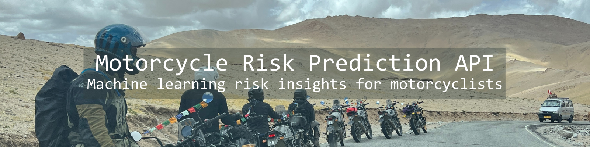
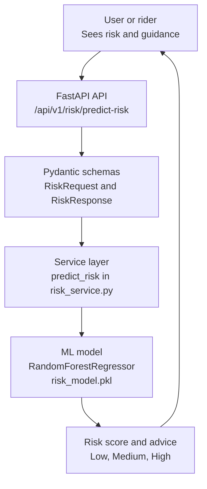

<p align="center">
  
</p>

# Motorcycle Risk Prediction API


## 1. Introduction
I ride almost every day. I've toured across borders, climbed high-altitude mountain passes in the himalayas, and wandered through places where roads turn into suggestions. On a motorcycle, you feel everything - the cold air before sunrise, the warning smell of incoming rain, the way visibility drops when fog rolls in. These little signals matter, they're part of every rider's instinct.

But instincts aren't perfect. So I decided to build something that blends my lived experience with machine learning: a system that predicts accident risk based on weather, visibility, distance, time of day, and rider experience.

This project brings that experience into a real machine learning system that helps riders better quantify risk before they hit the road.

---

## 2. What This Project Does
This is a complete end-to-end ML + API system that:
- Generates a hybrid dataset using real US accident data
- Engineers rider-relevant features (temperature, rainfall, visibility, experience, etc)
- Trains a RandomForest regression model to estimate risk
- Serves predictions through a FastAPI endpoint
- Provides risk levels (Low, Medium, High) and contextual safety advice
- Is structured like a real production service

---

## 3. Project Structure
```
motorcycle-risk-api/
    app/
        api/
            v1/
                risk_endpoints.py
        schemas/
            risk.py
            echo.py
        services/
            risk_service.py
        main.py

    data/
        processed/
            us_accidents_risk_sample.csv

    ml/
        train_model.py
        risk_model.pkl  (ignored in git)

    requirements.txt
    README.md
```

---

## 4. Architecture Overview



---

## 5. API Overview
Base URL (local):
```
http://127.0.0.1:8000
```

### Main Prediction Endpoint
**POST** `/api/v1/risk/predict-risk`

Request body:
```json
{
  "temperature": 30,
  "rainfall": 0.5,
  "visibility": 10,
  "distance": 80,
  "time_of_day": "evening",
  "experience": 5
}
```

Response:
```json
{
  "risk_score": 0.462,
  "risk_level": "Medium",
  "advice": "Exercise caution. Consider reducing speed and increasing following distance."
}
```

---

## 6. Machine Learning Pipeline
### Dataset
I started with the US Accidents dataset ([downloaded from Kaggle](https://www.kaggle.com/datasets/sobhanmoosavi/us-accidents?resource=download)) and extracted:
- Temperature (converted to Celsius)
- Rainfall
- Visibility
- Distance
- Time of day
- Synthetic rider experience
- A simple engineered risk score based on severity and weather

### Model
RandomForestRegressor with:
- 200 trees
- train-test split of 80/20
- MAE around ~0.16

### Why RandomForest?
- Works well with mixed numeric + categorical features
- Handles non-linear relationships
- Robust even with noisy or synthetic features
- Requires minimal preprocessing

---

## 7. Running the Project
### 1. Create the virtual environment
```
python -m venv .venv
.venv\Scripts\activate
```

### 2. Install dependencies
```
pip install -r requirements.txt
```

### 3. Run the API
```
uvicorn app.main:app --reload
```

### 4. Train the ML model (optional)
```
python ml/train_model.py
```

---

## 8. Deployment
This project is deployable on:
- Render
- Railway
- Docker (future step)

Once deployed, the API will behave exactly the same as the local version.

---

## 9. Why This Project Matters
This is not just a coding exercise, it's grounded in lived experience.

Riders make hundreds of micro-judgments every minute. Understanding how environmental factors influence risk can genuinely help riders make safer decisions. This project is my attempt to bring together two worlds I care deeply about: motorcycling and applied machine learning.

---

## 10. Future Improvements
- Add more granular weather categories
- Add GPS route-risk scoring
- Add a simple frontend for riders
- Deploy model as a versioned ML service
- Replace hybrid experience data with real rider data

---

## 11. Credits
- US Accidents dataset from Kaggle
- FastAPI for the backend framework
- scikit-learn for model training
- My 2019 Yamaha XSR 900 "Badal" for inspiring all of this

Ride safe and stay curious.
